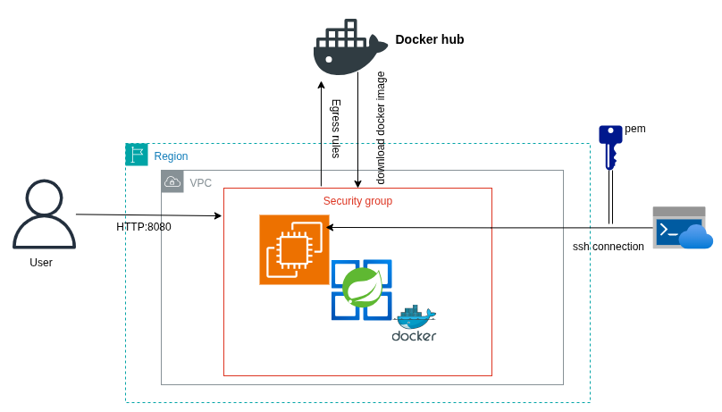

# Spring Boot AWS Deployment Demo

This is a practical demonstration of integrating **Spring Boot** with **Docker** for cloud deployment. The project shows how to containerize an application, host the image on **Docker Hub**, and deploy it securely to an **AWS EC2** instance.

---

## 🏗️ Architecture

The diagram below illustrates the components and data flow for the application deployment.



## 🚀 Technologies Used

* **Application:** Spring Boot / Java
* **Containerization:** Docker
* **Registry:** Docker Hub (for image hosting)
* **Cloud Infrastructure:** AWS (EC2, VPC, Security Groups)
* **Deployment Method:** SSH Connection

## ⚙️ Setup and Deployment Steps
In this demo, I followed this steps:

1.  **Clone the Repository:**
    ```bash
    git clone [My_repo_url]
    ```
2.  **Build the Docker Image:**
    ```bash
    docker build -t my-dockerhub-username/spring-app:latest .
    ```
3.  **Push to Docker Hub:**
    ```bash
    docker push my-dockerhub-username/spring-app:latest
    ```
4.  **AWS Configuration:**
    * Set up a VPC and a Security Group with Ingress rules for ports 22 (SSH) and 8080 (HTTP).
    * Launch an EC2 instance with the configured Security Group.
5.  **Deploy to EC2 (via SSH):**
    * SSH into the instance using my PEM key.
    * Install Docker on the EC2 instance.
    * Pull and run the image:
        ```bash
        docker run -d -p 8080:8080 my-dockerhub-username/spring-app:latest
        ```

## 🔗 Access the Application

Once deployed, I can access the running Spring Boot application at:

`http://[my-EC2-Public-IP]:8080`
